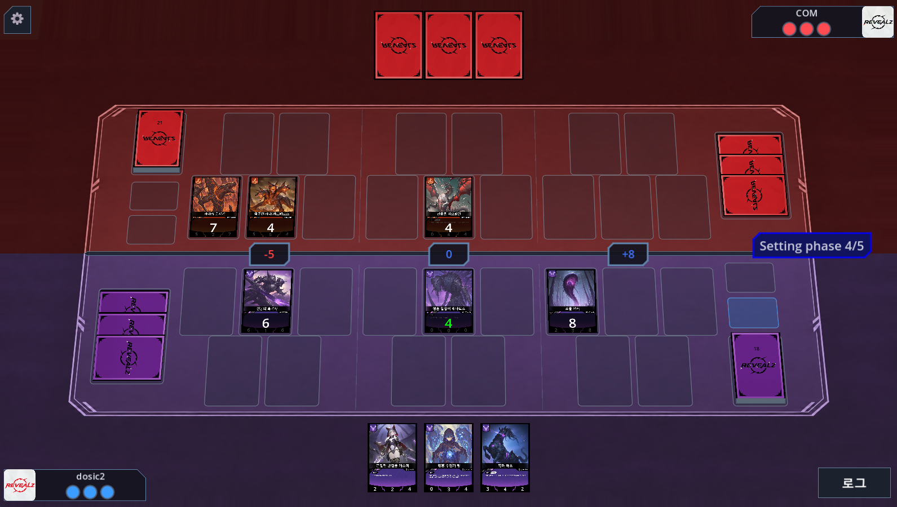
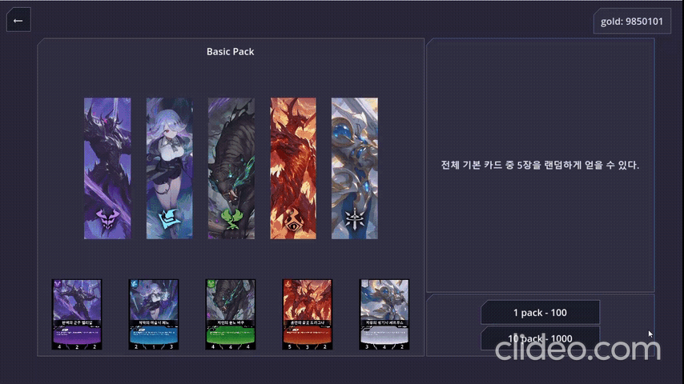
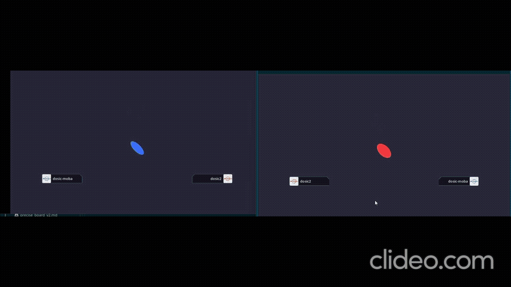

# revealz-online

Godot 4 턴제 카드 게임과, 실제로 게임을 운영하기 위한 프로젝트입니다.

| 항목 | 내용 |
|------|------|
| 기간 | 2025 ~ 진행 중 |
| 인원 | 1인 개발 (클라이언트 / 서버 / 인프라 / 운영) |
| 상태 | **MVP** — 수집 → 덱 편성 → 온라인 대전으로 이어지는 핵심 루프가 실제 서버에서 동작 |
| 공개 범위 | 게임, 서버, 인프라 소스 및 자체 제작 에셋 / 시크릿, 서버 주소, Dedicated 바이너리 제외 |

---

## 개요

**게임 — 클라이언트**
- 라인별 파워를 겨루어 **2개 이상의 라인에서 승리**하여 상대 라이프를 소진시키는 것이 목표인 턴제 카드 게임
- 카드 수집, 팩 오픈, 덱 편성, 싱글 플레이, 온라인 대전
- 서버 권위 매치 세션, 매칭 로딩·대전 연출 UI

**서버 운영**
- Java 21 / Spring Boot 단일 애플리케이션: 인증, 매칭, 메타 API, 운영 API, Dedicated 프로세스 관리
- PostgreSQL 메타 DB: 계정, 골드, 보유 카드, 상점 카탈로그, 선물함, refresh token
- Redis: 공개 상점 카탈로그 캐시. 캐시 장애 시 PostgreSQL 조회로 돌아가는 보조 계층
- Nginx HTTPS 프록시, Docker Compose 기반 스택, GitHub Actions CI, health poller
- 토큰으로 보호되는 운영 화면: 모니터링, 점검, 계정 조치, DB 백업/복구, 패치노트

---

## 플레이 / 기능

### 인게임

3개 라인에 카드를 배치하고 파워를 겨룹니다. 카드마다 3개 라인에서의 파워가 다르고, 카드 효과가 라인 파워와 서로의 배치에 개입하기 때문에, 어느 라인을 버리고 어느 라인을 가져갈지 고르는 것이 핵심입니다.




### 덱 편집

보유 카드 기준으로 덱을 구성합니다. 포맷별 규칙 검증은 클라이언트뿐 아니라 **Spring과 Dedicated에서도 다시 검사**해서, 조작된 덱으로 매치에 들어오지 못하게 막습니다.


### 상점 · 팩 오픈

가격/확률/카드 풀은 클라이언트가 아니라 **DB의 상점 카탈로그**에 있습니다. 클라이언트는 "어떤 상품을 몇 개 산다"만 보내고, 실제 차감과 랜덤 획득은 서버 트랜잭션 안에서 처리됩니다.




### 온라인 매치



---

## 아키텍처

```text
클라이언트 (Godot) ──HTTPS──▶ Nginx ──▶ Spring Boot
       │                                ├──▶ PostgreSQL
       │                                ├──▶ Redis (catalog cache)
       │                                └──spawn──▶ Dedicated (Godot headless)
       └──────────────── UDP / ENet ─────────────▶ Dedicated
```

- **HTTP와 UDP를 분리**했습니다. 로비/계정/상점 같은 메타 요청은 HTTP로, 실제 대전 중의 잦은 상태 교환은 지연에 민감하므로 UDP(ENet)로 처리합니다.
- **인증**: Windows 클라이언트가 Google Desktop OAuth로 받은 ID token을 Spring이 검증하고, 짧은 access JWT와 rotation되는 refresh token을 발급합니다. 계정 API와 매치 입장 ticket은 JWT의 계정 소유권을 다시 확인합니다.
- **데이터 접근**: 계정·패치노트처럼 기본 CRUD와 단순 조회는 JPA를 사용합니다. 구매·우편·복합 스냅샷처럼 여러 행의 잠금, revision 검사, 중복 방지가 필요한 경로는 명시적인 JDBC SQL을 같은 transaction 안에서 사용합니다.
- **구매 정합성**: 클라이언트는 상품 ID와 수량만 보냅니다. 서버가 DB 카탈로그에서 가격과 풀을 읽고, 재화 차감과 카드 지급을 하나의 transaction으로 완료하거나 전부 되돌립니다.
- **매칭**: 큐에서 두 사용자가 매치되면 Spring이 Dedicated를 실행합니다. 프로세스 생성, ready 로그 확인, 좌석별 일회성 입장 ticket 발급, 접속, 종료 정리 순서로 관리합니다.
- **Redis 범위**: 현재는 카탈로그 응답 캐시에만 사용합니다. 구매의 정답과 transaction은 PostgreSQL에 남습니다.
- **배포 경계**: 공개 저장소의 workflow는 Spring 테스트만 수행합니다. 운영 배포와 컨테이너 교체는 공개 workflow에 포함하지 않습니다.

---

## 운영

혼자 만든 게임이라도 서버에 올라가는 순간 "지금 문제는 없는지", "문제가 생기면 무엇을 할 수 있는가"에 답할 수단이 필요합니다. 그래서 관측 → 점검 → 조치 → 복구까지의 도구를 함께 만들었습니다.

### 모니터링

poller가 주기적으로 `/v1/health`를 통해 결과를 JSON Lines로 쌓고, 운영 화면이 이를 시계열로 보여줍니다.


### 점검 (maintenance)

운영 화면에서 점검을 켜면 게임 클라이언트가 즉시 점검 안내로 전환됩니다. 서버 쪽 스위치 하나가 실제 게임 통신을 막는 구조라, 긴급 상황에서 배포 없이 유입을 끊을 수 있습니다.


### 백업 / 복구

점검을 건 상태에서 `pg_dump`로 스냅샷을 남기고, 필요하면 목록에서 골라 복구합니다.


### 계정 조치 / 지급 / 패치노트

계정 조회/삭제, 카드/재화 지급(선물함 경유), 패치노트 게시를 운영 화면에서 처리합니다.


---

## 담당 역할

1인으로 진행하였습니다.

| 영역 | 주요 내용 |
|------|-----------|
| 게임 클라이언트 (Godot) | 턴/카드 효과/덱/팩 오픈/매치 UI 및 연출, 서버 권위 세션 |
| 멀티플레이 연동 | 로비 HTTP 매칭 → ENet(UDP) 접속, 방 코드 및 랜덤 매칭 |
| 로비 / 메타 서버 (Spring Boot) | Google 인증, JWT/refresh, 매칭 큐, Dedicated lifecycle, 덱 검증, 구매 transaction, revision 충돌 처리 |
| 데이터 (PostgreSQL) | 스키마 설계, 상점 카탈로그, 선물함, 백업/복구 |
| 인프라 / 운영 | Docker Compose, GitHub Actions, health poller, 운영 화면 |

설계 배경 및 트레이드오프 기록 일부: [`docs/server_authority_decisions.md`](docs/server_authority_decisions.md)

---

## 기술 스택

| 영역 | 스택 |
|------|------|
| Client | Godot 4.5, GDScript |
| Lobby / Meta | Java 21, Spring Boot, Spring Data JPA, JDBC, PostgreSQL 16 |
| Cache / Edge | Redis (catalog cache), Nginx HTTPS reverse proxy |
| Ops | Python (health poller, ops CLI), HTML 운영 UI |
| Infra | Docker Compose, GitHub Actions |
| Network | HTTP (로비 / 메타 / 운영) + UDP / ENet (전용 서버) |

---

## 클라이언트 실행

**[📥 Releases에서 다운로드](https://github.com/codingdosic/revealz-public/releases/latest)**

`revealz_app.exe` 하나만 받아서 바로 실행할 수 있습니다.
- 서버 연결이 필요하며, 현재는 실서버 운영 상태에 따라 가능 여부가 달라집니다.

---

## 앞으로

핵심 루프가 도는 MVP 단계이고, 다음 두 방향으로 계속 다듬고 있습니다.

- **내부**: 매칭·Dedicated 운용 관측 보강, 인증·운영 도구의 안전한 개선
- **외부**: 카드 밸런스와 룰 조정 — 카드 데이터와 상점 카탈로그가 코드가 아닌 데이터에 있어 클라이언트 재배포 없이 조정 가능

내용은 개발 진행에 따라 언제든지 변경될 수 있습니다.
